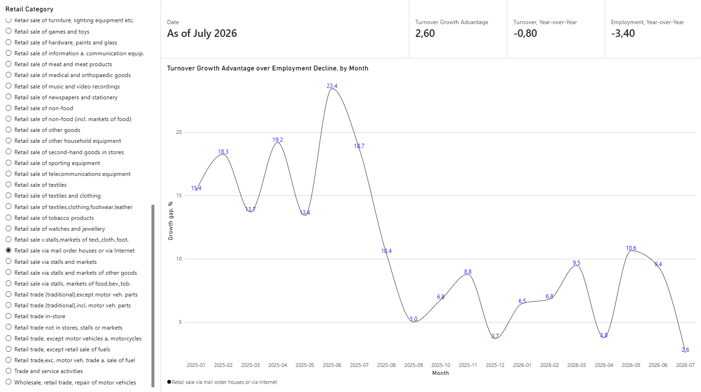
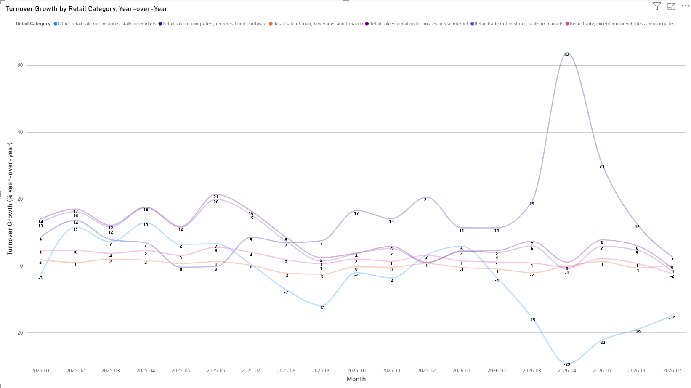

# Analysis: online vs. physical retail, Germany

## Decision

Should a mid-size retail business shift inventory/marketing budget toward online vs. physical retail next quarter, and which category shows real momentum right now?

**Stakeholder:** a retail chain's merchandising or expansion-planning lead.

## North Star metrics

- Month-over-month and year-over-year turnover growth, by channel (online vs. physical) and by retail category.
- Whether that growth survives seasonal/calendar adjustment — real momentum vs. noise, not just a busy month.
- Whether turnover growth tracks employment growth, or decouples in categories like online retail (`WZ08-4791`) where fewer staff serve more volume.

## Recommendation

1. **Shift budget toward online retail (`WZ08-4791`) is justified by 2025's data, but report it as a historical window, not current momentum.** Through 2025, online retail's turnover growth (+1.0% to +21.3% YoY) dramatically outpaced its own employment decline (-1.3% to -3.4% YoY) — checked against a physical-retail control (`WZ08-472`, food retail) whose turnover and employment moved together the whole period, ruling out a sector-wide artifact. For the merchandising lead: the 2025 case for online retail was real and efficiency-driven, not noise.
2. **Don't extend that 2025 case into a current-quarter budget call without the recency caveat.** The growth premium (`growth_gap_pct`) held in double digits (13.4–23.4) through July 2025, then closed to single digits by **September 2025**, and fluctuated in the single-to-low-double-digit range (2.6–10.6) through all of 2026, with turnover YoY itself going negative in July 2026 — the first negative month in the series — while employment decline continued at an unchanged pace. A full-period average would overstate today's online-retail advantage: the premium was gone well before mid-2026, not gradually fading through it. For the same stakeholder, directly answering the North Star's "real momentum... right now," not "was there momentum in 2025."
3. **Attribute part of 2026's cooling to real sector-wide softening, not purely online-specific saturation.** The whole retail aggregate (`WZ08-47`) also decelerates through 2026 (turnover YoY 4–5% → -2.4%), so some of the online-retail cooling is a real macro trend. But the amplitude doesn't match: `WZ08-4791` swung roughly three times wider than the aggregate, and two sibling categories moved in opposite, unexplained directions in the same window (`WZ08-4799` collapsed to -29.4% YoY; `WZ08-4741` accelerated to +63.8% YoY, verified against raw index levels to rule out a low-base artifact). Both macro and category-specific dynamics are real and layered, so a single-cause story would be wrong either way.
4. **Investigate `WZ08-4741`'s surge and `WZ08-4799`'s collapse before trusting either as durable — chosen to not be further investigated here.** Both are real, checked findings, not data artifacts, but their causes sit outside this project's own turnover/employment tables.
5. **Don't screen for category-level risk using a parent-category rollup alone.** `WZ08-479` (the level-3 parent of both `WZ08-4791` and `WZ08-4799`) tracks its larger, surging child almost exactly and barely moves when the smaller sibling collapses — a stakeholder checking only the parent aggregate would miss `WZ08-4799`'s -29.4% YoY collapse entirely. If a rollup category looks stable, that's not sufficient evidence its children are.

## Evidence

**The headline decoupling holds, and holds against a control.** `gold_turnover_vs_employment` (turnover YoY%, constant prices, calendar-seasonal-adjusted, vs. employment YoY%) shows online retail's turnover and employment moving in opposite directions for all 19 months of overlap (Jan 2025–Jul 2026): turnover up double digits most months while employment fell every month. Food retail, the control, shows turnover and employment tracking closely, with the gap between them near zero and flipping sign repeatedly. The differentiator is online retail's 2025 revenue growth, not an unusually aggressive pace of staff cuts, as by 2026 both categories show comparable employment decline.

**The premium is time-bound, not structural.** `growth_gap_pct` holds in double digits (13.4–23.4) from January through July 2025, then drops to single digits by September 2025 and stays in the single-to-low-double-digit range (2.6–10.6, non-monotonic) through all of 2026, with turnover YoY crossing zero in July 2026. Whether the underlying cause is a base-effect correction, genuine demand saturation, or a broader consumer-spending slowdown is not established from this data alone.

**Macro and category-specific effects are both real, checked against three additional sectors.** `WZ08-47` (whole retail trade) decelerates over the same window (turnover YoY ~4–5% in early 2025 to -2.4% by July 2026), confirming a real, modest sector-wide trend. But `WZ08-4799` (a sibling non-store retail category) doesn't decelerate gently like the aggregate — it collapses to -29.4% YoY by April 2026, with employment declining far less sharply (-3% to -6%) — a much sharper, distinct pattern. `WZ08-4741` (a physical-store category picked to test the "losing to e-commerce" hypothesis) shows the opposite of what it was picked to demonstrate: turnover accelerates to +63.8% YoY in April 2026, with employment essentially flat. That figure was verified against the underlying raw index levels (April 2025 = 116.7, April 2026 = 191.2 — both plausible, ruling out a low-comparison-base artifact).

**The parent-category rollup masks the sibling collapse it sits above.** Adding `WZ08-479` (`WZ08-4791` and `WZ08-4799`'s shared level-3 parent) to the same chart shows it tracking `WZ08-4791` within 1–2 points at nearly every month, while `WZ08-4799`'s collapse to -29.4% YoY barely registers in it — the larger sibling's revenue base dominates the aggregate too completely for the smaller sibling's problem to surface at that altitude.

## Data and reproduction

Full data-acquisition detail (registration, pull mechanics, table structure, gotchas): [`DATA_SOURCES.md`](DATA_SOURCES.md). Star-schema SQL: `sql/`. Ingestion/dimension-building scripts: `scripts/`.

**Limitations.** Correlation-style comparisons only, not causal, so expect no control/correction for broader macroeconomic conditions beyond the sector-vs-sector checks above. `WZ08-4741`'s surge and `WZ08-4799`'s collapse are named but not explained by this dataset.
