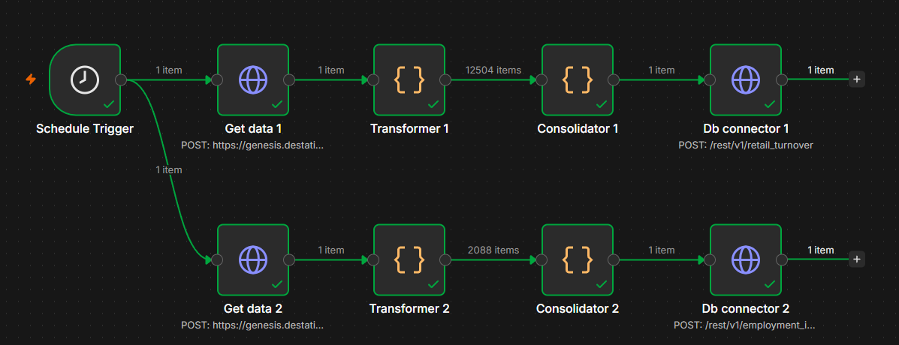

# Data sources

## Destatis GENESIS-Online

The German Federal Statistical Office's public statistics database. Free, no cost for basic access; a free personal account is required for any API use beyond the unauthenticated `whoami` test.

**To get access:**

1. Register at `https://www-genesis.destatis.de/genesis/online?Menu=Registrierung` (free).
2. Generate a personal API token, or use your account credentials directly — both work. The token option is under "Webservice (API)" in the web interface after login.
3. Auth is **POST only** — the older SOAP/XML interface and GET-with-credentials are both retired and will not work, regardless of what older tutorials or wrapper libraries show. Credentials (`username`, `password`) go in **HTTP headers**; every other parameter goes in the **request body**, `Content-Type: application/x-www-form-urlencoded`.
4. There is no anonymous/guest login on this instance — every method except `whoami` requires real credentials or a token.

**API base URL:** `https://genesis.destatis.de/genesisWS/rest/2020/` — note the API subdomain drops the `www-` that the web interface's URL uses.

## Pulling a table

**Endpoint:** `POST data/table`, with a body like `name=<table-id>&area=all&compress=true&timeslices=3&language=en`.

**Send only the parameters you need."** The API treats a parameter that's present-but-blank differently from one that's simply absent, and this isn't documented anywhere. Concretely: adding `startyear`/`endyear` as empty strings silently narrows the result to the current year only; omitting them entirely returns the full history. If a pull looks truncated, check for exactly this before assuming the API or the table is at fault.

**`timeslices` may be silently ignored** depending on the method a request with `timeslices=3` can still return the full history regardless of the value given.

**Response shape:** the response is a JSON envelope; the actual table is an embedded **CSV string** inside `Object.Content`, not nested JSON. Expect:
- ~10 metadata/header lines first (table name, title, unit, column headers), then data rows.
- `;`-delimited fields, with a **period** as the decimal separator.
- Missing values as the literal string `-` (and, in some tables, also `x` — see below) rather than a blank field. Both need explicit mapping to null; naively parsing either as a float will raise.
- A footer line (`Federal Statistical Office, Wiesbaden` + a `created:` timestamp) is worth capturing per-pull if you want to track data freshness.

**A table can carry more than one missing-value placeholder.** `-` generally means "nothing to report"; `x` means "not meaningful/not computable" and shows up specifically where a value can't be computed (e.g. a year-over-year change with no prior-year baseline to compare against). Check a table's actual raw response for both before assuming one placeholder generalizes from another table you've already handled.

**A table's WZ08 (or other classification) codes may mix more than one scheme.** Some tables carry both a standard hierarchical code set (e.g. `47`, `471`, `4711`) and a second, differently-suffixed set that's an alternate regrouping rather than a finer breakdown of the same hierarchy (e.g. `45-01` alongside plain `45`). Filter to the specific codes you actually want rather than ingesting every code blindly.

**Before building a pipeline around a table, check its actual raw structure directly** rather than trusting a name or category description — tables with similar names are prone to have genuinely different shapes (e.g. a regional breakdown that turns out to carry no sector dimension at all, or an "annual" table that's just a coarser rollup of a monthly one already in use). Unfortunately, Destatis's own catalog descriptions aren't always enough to tell tables like this apart before pulling them.

## The tables used in this project

| Field | Value |
|---|---|
| Statistic | 45212 — Monatsstatistik im Einzelhandel |
| `retail_turnover` table | 45212-0005 — Umsatzindex im Einzelhandel: Deutschland, Monate, Preisarten, Original- und bereinigte Daten, Wirtschaftszweige |
| `employment_index` table | 45212-0002 — monthly employment index, same statistic family |
| Grain | Monthly, national, by WZ2008 sector |

**`retail_turnover` (45212-0005)** — six value columns per row: `{at constant prices, at current prices} × {unadjusted, calendar-adjusted, calendar-and-seasonally-adjusted}`. Row shape: `WZ08-code;description;year;month;val1;...;val6`. Includes `WZ08-4791` ("Versand- und Internet-Einzelhandel" — mail-order/internet retail) as its own line, so online retail is directly present without needing to be constructed from a broader category.

**`employment_index` (45212-0002)** — one value series per row (`index_value`, `yoy_change_pct`), not the six-column split above — there's a single underlying measurement method here, not six. Row shape: `code;description;year;month;index_value;yoy_change_pct`. Uses both `-` and `x` as missing-value placeholders (see above).

**Two adjacent tables in the same statistic family were considered and are not used here:** 45212-0014 (a regional/Bundesland breakdown — carries no WZ08 sector dimension at all, so it can't answer a sector-level question regardless of row count) and 45212-0001/0003 (annual rollups of the same series already used at monthly grain, so pulling them would add no information). 

## Automated refresh

Both tables refresh on a schedule via an n8n workflow, reusing the same request/parsing logic as the one-shot pull scripts (`scripts/pull_retail.py`, `scripts/pull_employment.py`) rather than a second implementation.

**Schedule:** the 5th of each month. Destatis publishes preliminary results roughly 30 days after the reference month ends, so day 5 gives a safe buffer past that.

**Per table:** HTTP Request (GENESIS auth, POST) → a Code node that parses the raw CSV into rows (`n8n/parse_turnover.js`, `n8n/parse_employment.js`) → a Code node that merges the parsed rows into a single bulk payload (`n8n/merge_items.js`) → an HTTP Request that upserts into Supabase via PostgREST (`Prefer: resolution=merge-duplicates`, relying on each table's primary key as the conflict target). Both tables run as parallel branches off one schedule trigger.

**The workflow definition itself will not be published here.** Its GENESIS and Supabase credentials are stored as static values on the HTTP Request nodes rather than in n8n's credential vault for privacy reasons. The three Code node scripts above and the canvas screenshot (with connection URLs kept out of it) are the pipeline artifacts checked into this repo. Reproducing the schedule/auth/upsert nodes from the description above is straightforward in any workflow tool.
